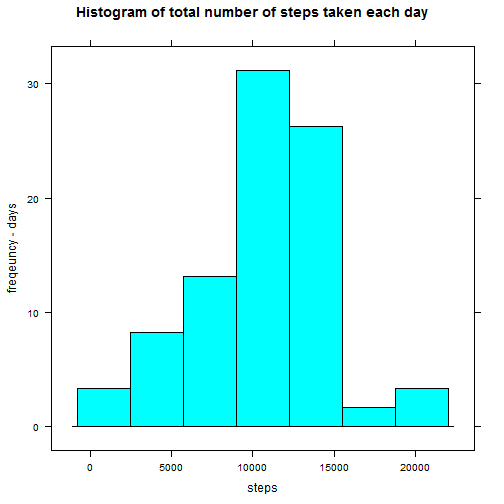
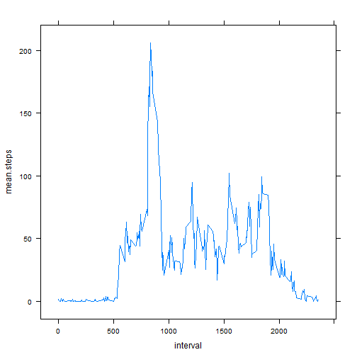
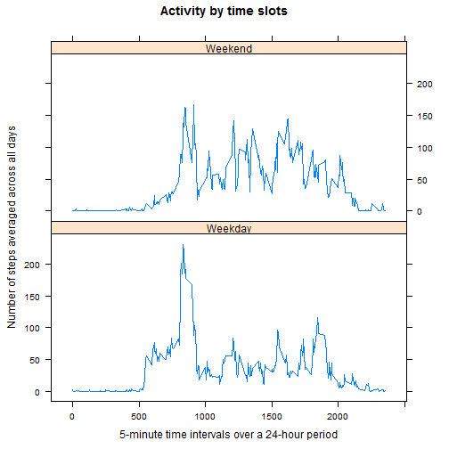

# Reproducible Research: Peer Assessment 1
======================================================

## step 1. Load the data 


```r
activity.data <- read.csv("activity.csv")
apply(activity.data, 2, class)
```

```
##       steps        date    interval 
## "character" "character" "character"
```

```r
summary(activity.data)
```

```
##      steps               date          interval   
##  Min.   :  0.0   2012-10-01:  288   Min.   :   0  
##  1st Qu.:  0.0   2012-10-02:  288   1st Qu.: 589  
##  Median :  0.0   2012-10-03:  288   Median :1178  
##  Mean   : 37.4   2012-10-04:  288   Mean   :1178  
##  3rd Qu.: 12.0   2012-10-05:  288   3rd Qu.:1766  
##  Max.   :806.0   2012-10-06:  288   Max.   :2355  
##  NA's   :2304    (Other)   :15840
```

Missing values: How many records with missing data?
total number of records, missing values for each variable

```r
nrow(activity.data); sum(is.na(activity.data$steps)); sum(is.na(activity.data$date)); sum(is.na(activity.data$interval))
```

```
## [1] 17568
```

```
## [1] 2304
```

```
## [1] 0
```

```
## [1] 0
```

## step 2. preprocess the data
convert steps to numeric;  might be useful later.
convert date to type Date, will allow use of weekdays() function 
convert interval to type integer

```r
activity.data$steps <- as.numeric(activity.data$steps)
activity.data$date <- as.Date(activity.data$date)
activity.data$interval <- as.integer(activity.data$interval)
class(activity.data$steps)
```

```
## [1] "numeric"
```

```r
class(activity.data$date)
```

```
## [1] "Date"
```

```r
str(activity.data)
```

```
## 'data.frame':	17568 obs. of  3 variables:
##  $ steps   : num  NA NA NA NA NA NA NA NA NA NA ...
##  $ date    : Date, format: "2012-10-01" "2012-10-01" ...
##  $ interval: int  0 5 10 15 20 25 30 35 40 45 ...
```

# Key results

## step3 . What is mean total number of steps taken per day?

the mean number of steps taken per day regardless of missing values:

```r
sum(activity.data$steps, na.rm=TRUE)/61
```

```
## [1] 9354
```

Histogram of the total number of steps taken each day

```r
sum.steps.day <- aggregate(activity.data$steps, list(activity.data$date), sum)
str(sum.steps.day)
```

```
## 'data.frame':	61 obs. of  2 variables:
##  $ Group.1: Date, format: "2012-10-01" "2012-10-02" ...
##  $ x      : num  NA 126 11352 12116 13294 ...
```

```r
library(lattice)
histogram(~x, data = sum.steps.day, xlab = "steps",ylab = "freqeuncy - days", main = "Histogram of total number of steps taken each day" )
```

 

mean steps taken per day

```r
steps.day <- aggregate(activity.data$steps, list(activity.data$date), sum)
str(steps.day)
```

```
## 'data.frame':	61 obs. of  2 variables:
##  $ Group.1: Date, format: "2012-10-01" "2012-10-02" ...
##  $ x      : num  NA 126 11352 12116 13294 ...
```

```r
mean(steps.day$x, na.rm=TRUE)
```

```
## [1] 10766
```
median steps taken per day

```r
median(steps.day$x, na.rm=TRUE)
```

```
## [1] 10765
```


## step 4. What is the average daily activity pattern?

```r
complete.data <- activity.data[complete.cases(activity.data), ]
sum(is.na(complete.data$steps))  ## check that NAs hv been removed
```

```
## [1] 0
```

```r
nrow(complete.data)
```

```
## [1] 15264
```

```r
steps.interval <- aggregate(complete.data$steps, list(complete.data$interval), mean)
colnames(steps.interval) <- c("interval","mean.steps")
nrow(steps.interval)
```

```
## [1] 288
```

```r
str(steps.interval)
```

```
## 'data.frame':	288 obs. of  2 variables:
##  $ interval  : int  0 5 10 15 20 25 30 35 40 45 ...
##  $ mean.steps: num  1.717 0.3396 0.1321 0.1509 0.0755 ...
```

```r
xyplot(mean.steps~interval, steps.interval, type ="l")
```

 

the 5 minute interval that accounts for the max no of steps on average across all days

```r
tail(steps.interval[order(steps.interval$mean.steps), ], 1)
```

```
##     interval mean.steps
## 104      835      206.2
```

Answer: The 0835 to 0840 5 minute interval sees the most steps This is also shown in the time series plot.

## step 5. Impute missing values
My strategy is to assume that activity level in a given 5 minute interval is pretty much the same each day.
very likely there is some variation between weekday vs weekend and even across the day of the week
But to kep it simple I have assumed that it would be reasonable to replace a missing value with the mean for 
that timeslot across all the days for which there is data. i.e I have not made any adjustments for w/day / w/end.
The following function does the imnputatation


```r
replaceNA <- function(activity.data) {
        for (i in 1 : nrow(activity.data)) {
                if (is.na(activity.data[i, 1])) {
                        for (j in 1 : nrow(steps.interval)) {
                                if (activity.data[i, 3] == steps.interval[j, 1]) {
                                #print(i); print(j)
                                #print(steps.interval[j, 2])
                                activity.data[i, 1] <- steps.interval[j, 2]
                                #print(activity.data[i, 1])
                                } # end of inner if
                        } # end of inner for loop
                } #end if
        }#end of 1st for loop
return(activity.data)
} # endfunction
```

Run the replaceNA function

```r
imputed.data <- replaceNA(activity.data)
```

Check that it has worked There should be no NAs in imputed.data


```r
#head(imputed.data)
#tail(imputed.data)
str(imputed.data)
```

```
## 'data.frame':	17568 obs. of  3 variables:
##  $ steps   : num  1.717 0.3396 0.1321 0.1509 0.0755 ...
##  $ date    : Date, format: "2012-10-01" "2012-10-01" ...
##  $ interval: int  0 5 10 15 20 25 30 35 40 45 ...
```

```r
sum(is.na(imputed.data$steps))
```

```
## [1] 0
```

It works!!

## step 6. Are there differences in activity patterns between weekdays and weekends?

add a variable to the dataframe imputed.data to show whether its a weekend or a weekday


```r
fun.days <- c("Saturday", "Sunday")
imputed.data$weekend <- ifelse(weekdays(imputed.data$date) %in% fun.days, c("Weekend"),
                               c("Weekday") ) 
str(imputed.data)
```

```
## 'data.frame':	17568 obs. of  4 variables:
##  $ steps   : num  1.717 0.3396 0.1321 0.1509 0.0755 ...
##  $ date    : Date, format: "2012-10-01" "2012-10-01" ...
##  $ interval: int  0 5 10 15 20 25 30 35 40 45 ...
##  $ weekend : chr  "Weekday" "Weekday" "Weekday" "Weekday" ...
```

```r
imputed.data$weekend <- as.factor(imputed.data$weekend) # may not be a necessary step
table(imputed.data$weekend) # weekends to weekdays should be about 2:5 ratio
```

```
## 
## Weekday Weekend 
##   12960    4608
```

```r
library(lattice)
attach(imputed.data)
xyplot(steps~interval|weekend, type = "l", 
       main = "Activity by time slots", 
       layout = c(1,2))
```

 

```r
detach(imputed.data)
```

Panel plot of steps against time slots to show weekday / weekend differences.
My conclusion: Weekday activity starts much earlier in the day. On weekends starts laterand appears to peak late afternoon / early evening.

End of exercise

