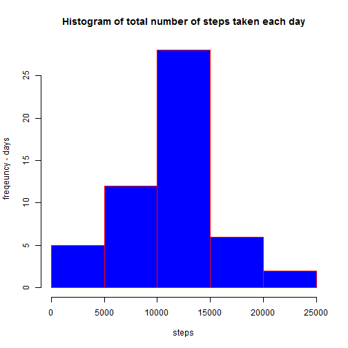

# Reproducible Research: Peer Assessment 1
======================================================

## step 1. Load the data 


```r
activity.data <- read.csv("activity.csv")
apply(activity.data, 2, class)
```

```
##       steps        date    interval 
## "character" "character" "character"
```

```r
summary(activity.data)
```

```
##      steps               date          interval   
##  Min.   :  0.0   2012-10-01:  288   Min.   :   0  
##  1st Qu.:  0.0   2012-10-02:  288   1st Qu.: 589  
##  Median :  0.0   2012-10-03:  288   Median :1178  
##  Mean   : 37.4   2012-10-04:  288   Mean   :1178  
##  3rd Qu.: 12.0   2012-10-05:  288   3rd Qu.:1766  
##  Max.   :806.0   2012-10-06:  288   Max.   :2355  
##  NA's   :2304    (Other)   :15840
```

Missing values: How many records with missing data?
total number of records, missing values for each variable

```r
nrow(activity.data); sum(is.na(activity.data$steps)); sum(is.na(activity.data$date)); sum(is.na(activity.data$interval))
```

```
## [1] 17568
```

```
## [1] 2304
```

```
## [1] 0
```

```
## [1] 0
```

## step 2 preprocess the data

#```{r}
#activity.data$date <- as.Date(activity.data$date)
#class(activity.data$date)
```

# Key results

## What is mean total number of steps taken per day?

the mean number of steps taken per day regardless of missing values:

```r
sum(activity.data$steps, na.rm=TRUE)/61
```

```
## [1] 9354
```
Histogram of the total number of steps taken each day

```r
sum.steps.day <- aggregate(activity.data$steps, list(activity.data$date), sum)
hist(sum.steps.day[,2], main = "Histogram of total number of steps taken each day", xlab = "steps", ylab = "freqeuncy - days", border = "red", col = "blue", )
```

 

mean steps taken per day

```r
steps.day <- aggregate(activity.data$steps, list(activity.data$date), sum)
mean(steps.day$x, na.rm=TRUE)
```

```
## [1] 10766
```
median steps taken per day

```r
median(steps.day$x, na.rm=TRUE)
```

```
## [1] 10765
```


## What is the average daily activity pattern?


## Imputing missing values


## Are there differences in activity patterns between weekdays and weekends?
